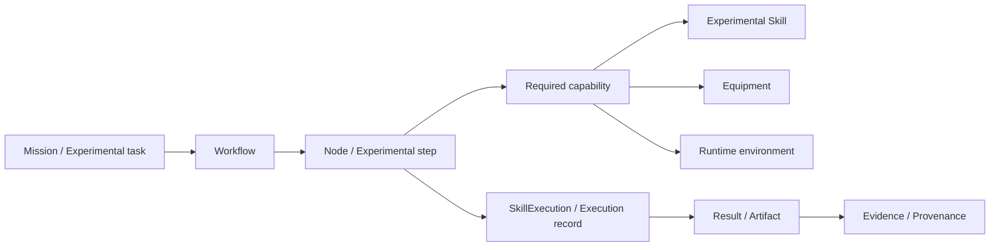
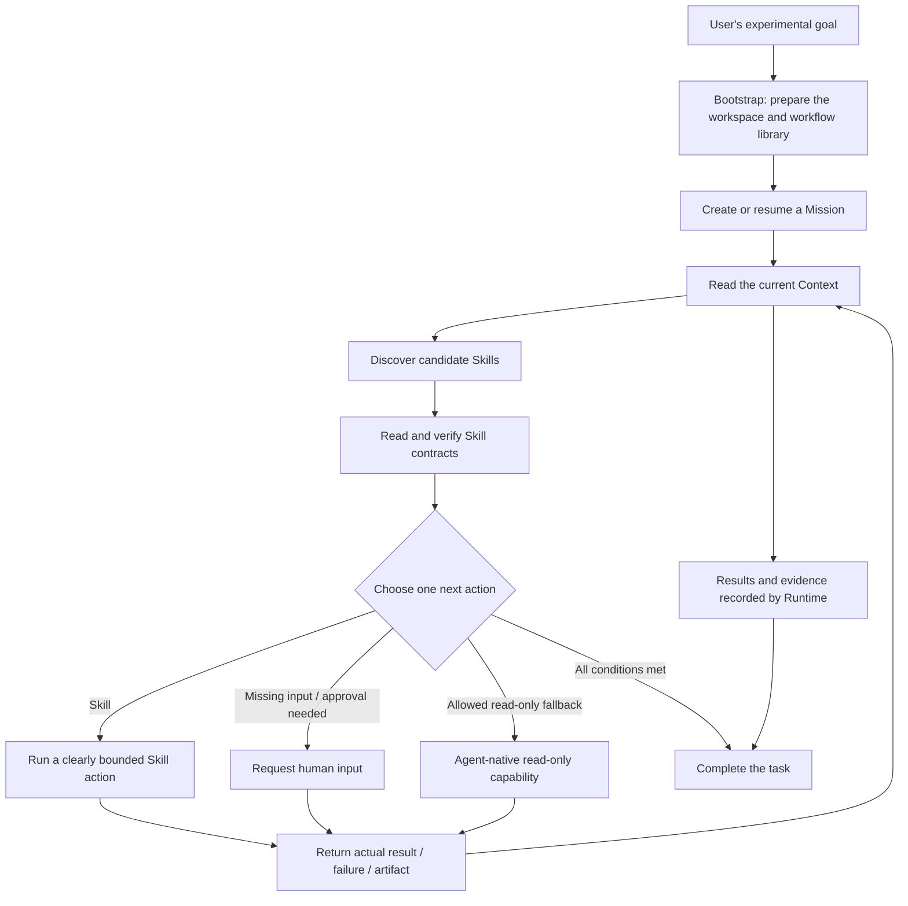

<div align="center">

# LabOntology

### An Ontology-Driven Orchestration and Runtime Supervision Framework for Autonomous Laboratory Agents

**Organize Experimental Capabilities · Supervise Task Execution · Preserve Evidence Trails · Improve Workflows**

[](https://www.python.org/)
[](#quick-start)
[](./Examples.md)

[English](./README.md) · [中文](./README.zh.md)

</div>

---

## Project Overview

**LabOntology** is an ontology-driven **control layer and unified Skill entry point for laboratory agents**.

Rather than having an agent call experimental tools in isolation, LabOntology organizes the **experimental goal, workflow, capabilities, execution constraints, equipment, runtime environment, task state, results, and evidence** in a shared experimental information network. The agent can use this network to determine what it can do, which Skill to call, what conditions are missing, and which actions require human confirmation.

In operation, LabOntology serves as a **unified entry point and ongoing supervisor** for experimental tasks:

- Organizes tasks around **experimental goals**, rather than isolated tool calls;
- Discovers and checks suitable **experimental Skills** for the current task;
- Manages multi-step experiments with explicit **states**, including pause, failure, and recovery;
- Retains **result provenance and supporting evidence** before a task is marked complete;
- Maintains reusable **experimental workflows** from successful experience and failure feedback;
- Preserves clear **human-control boundaries** for equipment-related and other high-impact actions.

> [!IMPORTANT]
> LabOntology is **not an instrument driver**, and it does not replace domain-specific experimental Skills.<br>
> It organizes task state, selects capabilities, supervises execution boundaries, and records evidence; the selected experimental Skill performs the domain operation.

---

## Why LabOntology?

An autonomous laboratory agent may have access to many heterogeneous capabilities: analysis tools, simulation software, experimental protocol Skills, instruments, databases, and domain agents. The challenge is not simply whether a tool exists, but:

> **Can the right capability be selected for the current experimental state, run under the required constraints, and leave a process that can be traced, resumed, and reviewed?**

| Without a shared control layer | With LabOntology |
| --- | --- |
| Skills are called independently | Experimental requests enter through a shared supervision point |
| Task state is implicit in conversation context | Mission and Runtime state are recorded explicitly |
| Capability selection relies on names or keywords | Full Skill documents are reviewed against inputs, outputs, and constraints |
| A failure can interrupt the workflow | Tasks can pause, fail, be reconciled, and resume |
| Results become detached from how they were produced | Results are linked to execution state, sources, and evidence |
| Workflow improvements depend on human memory | Successful experience and failure feedback can inform reviewed workflow maintenance |

---

## Core Capabilities

### 1. Ontology-Driven Organization of Experimental Tasks

LabOntology represents an experiment as connected objects rather than a flat sequence of prompts.



This shared representation helps an agent understand both:

- **What the experiment is intended to do scientifically**
- **Whether it can be carried out under the current conditions**

### 2. Experimental Capability Discovery and Skill Supervision

For each action, LabOntology:

1. Reads the current Mission and Context;
2. Searches the workflow library for candidate Skills;
3. Reads the full Skill document instead of relying only on its name or keywords;
4. Checks its inputs, outputs, constraints, and execution boundaries;
5. Selects **one clearly bounded next action**.

Action types include:

- `skill`: run a verified experimental Skill;
- `request_human`: ask for missing materials, information, or human confirmation;
- `agent_fallback`: use the agent's native read-only capability when explicitly allowed;
- `complete`: finish only after the result has been recorded by Runtime.

### 3. Stateful Runtime Supervision

The minimal runtime loop is:

```text
bootstrap → mission → context → prepare-skill → act
                                      │
                                      ├─ waiting_agent → resume → context
                                      └─ waiting_human → resume → context
```

An interrupted action is reconciled before the task is planned again.

A result is not considered complete just because it appears in the conversation. The actual result, failure reason, and artifacts must be returned to Runtime, recorded, and made available in the current Context before the task can be marked complete.

### 4. Evidence-Oriented Experimental Execution

LabOntology links execution artifacts back to the task and the process that produced them. This makes it possible to ask:

- Which experimental node produced this result?
- Which Skill was used?
- What inputs and conditions were present during execution?
- Did Runtime record this result?
- Which evidence supports the final conclusion?

### 5. Reviewed Workflow Improvement

LabOntology records concise experience from successful tasks and structured feedback from failures. These records can inform future workflow-library maintenance, but **do not automatically modify the workflow graph**.

```text
Successful experience / failure feedback
                  ↓
        Propose a maintenance change
                  ↓
             Human review
                  ↓
        Maintain the workflow graph
                  ↓
        Updated, verified workflow library
```

This allows experience to accumulate while preventing an ordinary failure from silently changing future experimental behavior.

---

## Schema Model

LabOntology separates experimental knowledge and runtime activity into four layers.

| Layer | Role | Typical contents |
| --- | --- | --- |
| **Definition** | Describes reusable experimental concepts | Workflows, nodes, capabilities, relationships |
| **Data** | Represents scientific data in a specific task | Samples, materials, parameters, results, artifacts |
| **Control** | Describes when and how execution may proceed | Preconditions, checkpoints, approvals, constraints |
| **Execution** | Records what happened during execution | Mission state, SkillExecution, Runtime state, evidence |

Relationships connect these layers so that one representation can support planning, execution, monitoring, and review.

---

## Execution Lifecycle



The core principle is:

> **Plan from the current state → perform one clearly bounded action → record the actual result → plan again.**

---

## Quick Start

### Requirements

- Python **3.11+**
- An agent environment that supports local Skills
- Install LabOntology before installing domain-specific experimental Skills
- Install the domain Skills required by your experiment

The experimental Skills used in the repository's six examples are available through [SCPHub](https://scphub.intern-ai.org.cn/).

### Codex

In a Codex conversation, enter:

```text
$skill-installer Please install this Skill from https://github.com/lastour126-hub/LabOntology/tree/master/skills/labontology-skill
```

Install manually to your personal directory:

```text
~/.agents/skills/labontology/
```

For the current project only:

```text
.agents/skills/labontology/
```

### Claude Code

Enter:

```text
Install only the Skill directory from https://github.com/lastour126-hub/LabOntology/tree/master/skills/labontology-skill to ~/.claude/skills/labontology/.
```

For the current project only:

```text
.claude/skills/labontology/
```

### Cursor, Gemini CLI, OpenCode, and Other Compatible Agents

Install to:

```text
~/.agents/skills/labontology/
```

Or install in the project directory:

```text
.agents/skills/labontology/
```

After installation, start a new session or use the agent's Skill refresh mechanism.

> [!TIP]
> You do not need to initialize LabOntology manually for every experiment.<br>
> Ask the agent to **"Initialize LabOntology for the current project"**, or describe the experiment directly. It initializes on first use and can reuse the setup for later tasks in the same project.

---

## How to Use

Describe the experimental goal in natural language. You do not need to know internal commands or arrange the Skills yourself.

For example:

```text
Please analyze this experimental dataset and determine the next action with the strongest scientific rationale.
Use the experimental Skills already installed. If required inputs, materials, or capabilities are missing, state what is missing explicitly,
and make sure the final result can be traced to the relevant execution record and evidence.
```

LabOntology checks the available capabilities against the current task, selects a next action, and requests human input or confirmation when needed.

---

## Example Tasks

The repository includes six independent, end-to-end examples.

| Example | Scenario |
| --- | --- |
| **Small-molecule analysis** | Use domain Skills to analyze molecular or chemical data |
| **Lead-compound screening** | Organize candidate assessment and screening |
| **ELISA data analysis** | Analyze experimental assay results |
| **Physics simulation** | Run a science workflow for simulation and computation |
| **Synthetic biology simulation** | Coordinate a computational synthetic-biology task |
| **Crystal-structure analysis** | Analyze structural-science data |

Each example includes Skill installation prompts, task prompts, and completion criteria.

➡️ **[View all English examples](./Examples.md)**<br>
➡️ **[查看中文示例](./Examples.zh.md)**

---

## Safety and Execution Boundaries

LabOntology takes a conservative approach to actions that affect the physical world and to actions without sufficient evidence.

> [!WARNING]
> Equipment-related and other high-impact actions **are not executed automatically**.

LabOntology stops or requests human confirmation when:

- Required materials, samples, parameters, or evidence are missing;
- The current workflow library has no suitable registered Skill;
- A Skill's declared input conditions are not met;
- An action requires human approval, authorization, or confirmation;
- Another action is already waiting;
- It cannot confirm that a result was actually recorded in Runtime.

Read-only fallback does not bypass these checks.

---

## Repository Layout

```text
LabOntology/
├── skills/
│   └── labontology-skill/
│       ├── SKILL.md                 # Unified entry point and ongoing supervision rules
│       ├── references/              # Ontology definitions and Runtime protocol
│       │   └── runtime-protocol.md
│       └── scripts/                 # Workflow library, task state, and result records
├── Examples.md                      # English examples
├── Examples.zh.md                   # Chinese examples
├── README.md                        # English documentation
└── README.zh.md                     # Chinese documentation
```

### Key Files

- **`SKILL.md`**: Defines LabOntology's triggers, task-entry protocol, execution boundaries, and user-facing response rules.
- **`references/`**: Contains ontology definitions and the Runtime protocol.
- **`scripts/`**: Implements workflow-library setup, Mission state management, execution state, and result recording.
- **`Examples.md` / `Examples.zh.md`**: End-to-end usage examples.

---

## Design Principles

**One unified entry point for experimental requests**<br>
Experimental tasks should not bypass the supervision layer to call arbitrary capabilities directly.

**Advance one clearly bounded action at a time**<br>
Choose the next action from the current state instead of generating a long, unchecked chain of operations.

**Read the document before using a capability**<br>
Do not judge a candidate Skill by its name alone; verify its full document, inputs, outputs, and constraints.

**Require evidence before completing a task**<br>
A task can finish only when the result has been recorded by Runtime and can be read again from Context.

**Keep human oversight for high-impact actions**<br>
Missing inputs, approvals, and actions in the physical world remain explicit control points.

**Improve continuously without silent self-modification**<br>
Past experience can inform future decisions, but workflow-library updates must be reviewed and reversible.

---

## What LabOntology Is—and Is Not

**LabOntology is:**

- An ontology-based representation of experimental tasks and capabilities;
- A unified Agent Skill entry point for autonomous laboratory tasks;
- A stateful Runtime protocol for planning, execution, recovery, and completion;
- A traceability layer linking tasks, Skill executions, results, and evidence;
- A controlled mechanism for continuous maintenance of experimental workflows.

**LabOntology is not:**

- A replacement for chemistry, biology, simulation, or data-analysis Skills;
- A general-purpose instrument-control system;
- An authorization mechanism that bypasses laboratory safety rules or approval processes;
- A system that automatically rewrites its workflow graph after every failure.

---

## Project Philosophy

A useful scientific agent needs more than access to tools.

It also needs to know:

**What is the experimental goal → what capabilities are available → which conditions are met → what can be done now → what actually happened → what evidence supports the result → what should happen next?**

LabOntology provides a shared structure that connects these questions.

---

<div align="center">

**Scientific agents should not only be capable; they should also be stateful, traceable, and governable.**

[Examples](./Examples.md) · [中文 README](./README.zh.md)

</div>
