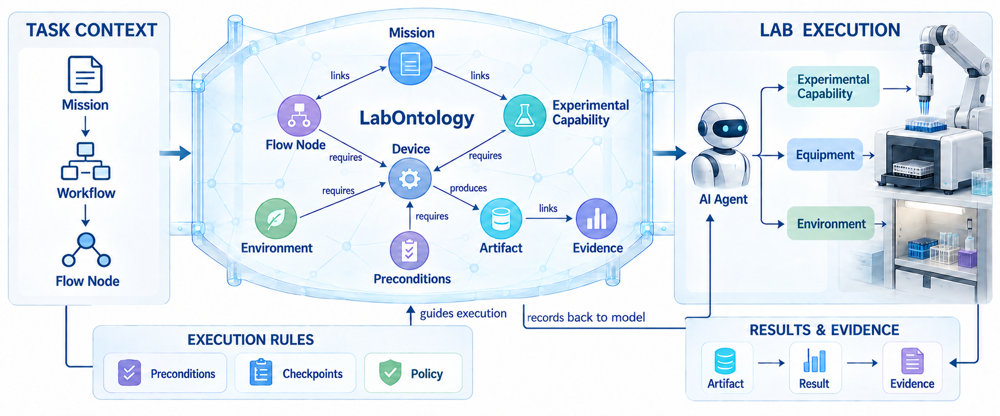
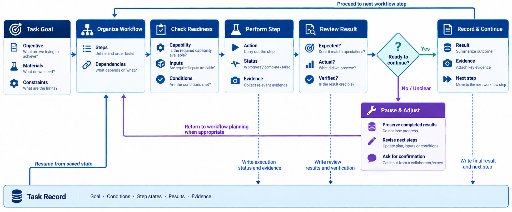
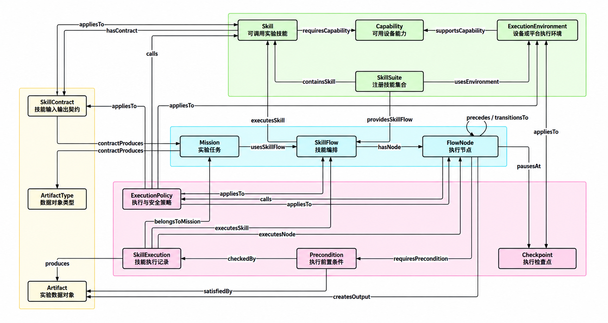

<p align="center">
  
</p>

<h2 align="center">围绕实验目标，组织实验能力并持续推进任务。</h2>

<p align="center">
  <a href="#自主实验的执行架构">执行架构</a> ·
  <a href="#实验任务的组织与推进">工作流</a> ·
  <a href="#schema-建模">Schema 模型</a> ·
  <a href="#快速开始">快速开始</a> ·
  <a href="Examples.zh.md">使用示例</a> ·
  <a href="#仓库内容">仓库内容</a>
</p>

<p align="center">中文 · <a href="README.md">English</a></p>

LabOntology 是一个面向自主实验场景的智能体技能包，旨在帮助 Agent 将实验知识、流程结构、执行约束、设备能力与结果数据组织成一张可查询、可推理并用于执行的实验信息网络。Agent 据此更好地规划任务、匹配实验能力、检查执行条件，并记录每一步结果及其依据，同时支持实验任务从规划和执行到监控与复盘。

## 自主实验的执行架构

任务包含工作流，工作流由节点组成；节点关联所需的实验能力，实验能力与设备和运行环境相匹配，执行产物则关联回任务。Agent 可以沿这些关系理解任务结构，并追溯结果的来源。



## 实验任务的组织与推进

工作流按节点组织实验步骤，并通过前置条件和检查点判断何时继续。节点完成后，Agent 根据状态和结果选择后续安排；信息不足或执行异常时，可调整计划或等待确认，已完成的结果仍保留在任务记录中。



## Schema 建模

Schema 分为定义、数据、控制和执行等层次，分别描述实验对象、任务记录、执行规则和运行状态。各层通过对象关系衔接，使实验知识与运行过程使用一致的表达。



## 快速开始

先安装 LabOntology，再按任务安装相应的实验 Skill。运行环境需要 Python 3.11 或更新版本。使用示例中的实验 Skill 均通过 [SCPHub](https://scphub.intern-ai.org.cn/) 获取；[使用示例](Examples.zh.md)中列出了六个完整案例和安装方法。

### Codex

在 Codex 对话中输入：

```text
$skill-installer 请从 https://github.com/lastour126-hub/LabOntology/tree/master/skills/labontology-skill 安装这个 Skill
```

手动安装时，可将 Skill 目录放到个人的 `~/.agents/skills/labontology/`，或项目的 `.agents/skills/labontology/`。详见 [Codex Skills 文档](https://learn.chatgpt.com/docs/build-skills)。

### Claude Code

在 Claude Code 中输入：

```text
请将 https://github.com/lastour126-hub/LabOntology/tree/master/skills/labontology-skill 安装到 ~/.claude/skills/labontology/；只获取这个 Skill 目录。
```

仅在单个项目中使用时，将安装位置改为该项目的 `.claude/skills/labontology/`。详见 [Claude Code Skills 文档](https://code.claude.com/docs/en/skills)。

### 其他 Agent

[Cursor](https://prod.cursor.com/help/customization/skills)、[Gemini CLI](https://geminicli.com/docs/cli/skills/) 和 [OpenCode](https://opencode.ai/docs/skills) 均可从 `.agents/skills/` 发现 Skill。在对应 Agent 中输入：

```text
请将 https://github.com/lastour126-hub/LabOntology/tree/master/skills/labontology-skill 安装到 ~/.agents/skills/labontology/；只获取这个 Skill 目录。
```

仅在单个项目中使用时，目标目录改为项目下的 `.agents/skills/labontology/`。安装前先确认没有同名目录；安装后新开会话，或使用 Agent 提供的技能刷新命令。

实验 Skill 也需安装在 Agent 可发现的技能目录下。环境准备好后，可以说“请初始化当前项目的 LabOntology”，也可以直接提出实验任务，由首次使用自动初始化；同一项目不必重复创建。

## 使用示例

示例包括小分子分析、先导分子筛选、ELISA 数据分析、物理模拟、合成生物学模拟和晶体结构分析。数据写在提示词中，或由 Agent 按给定参数生成；每个案例都附有 Skill 安装方法和任务提示词：[查看使用示例](Examples.zh.md)。

## 使用边界

LabOntology 负责组织任务和记录状态，具体实验操作由相应的 Skill 完成；它不直接控制仪器。缺少必要材料、条件或适用的 Skill 时，会说明当前不能继续的原因。设备相关或影响较大的动作不会自动执行。

## 仓库内容

- [SKILL.md](skills/labontology-skill/SKILL.md)：实验任务入口与使用边界。
- [references/](skills/labontology-skill/references/)：本体定义和 [Runtime 协议](skills/labontology-skill/references/runtime-protocol.md)。
- [scripts/](skills/labontology-skill/scripts/)：流程库整理、任务状态与结果记录的实现。
