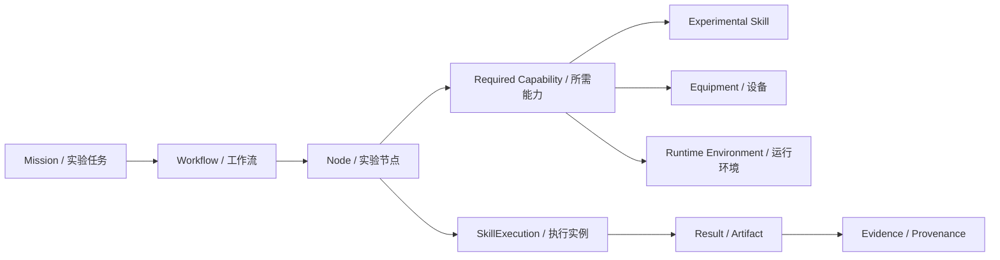
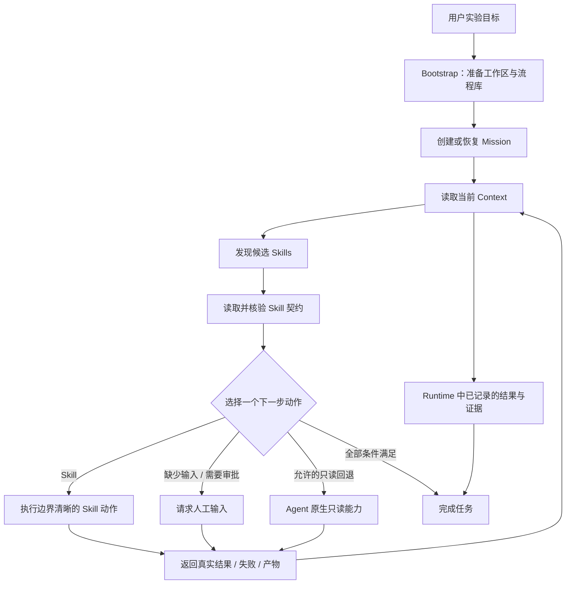

<div align="center">

# LabOntology

### 面向自主实验智能体的本体驱动编排与运行监督框架

**组织实验能力 · 监督任务执行 · 保留证据链 · 持续改进流程**

[](https://www.python.org/)
[](#快速开始)
[](./Examples.zh.md)

[中文](./README.zh.md) · [English](./README.md)

</div>

---

## 项目简介

**LabOntology** 是一个面向自主实验场景的、由本体驱动的 **实验 Agent 控制层与统一 Skill 入口**。

它并不是让 Agent 零散地调用各种实验工具，而是把 **实验目标、工作流、能力、执行约束、设备、运行环境、任务状态、结果和证据** 组织到统一的实验信息网络中。Agent 可以据此判断当前能做什么、应该调用哪个 Skill、还缺少什么条件，以及哪些动作需要人工确认。

在实际运行中，LabOntology 充当实验任务的 **统一入口和持续监督者**：

- 围绕**实验目标**组织任务，而不是围绕孤立工具调用；
- 根据当前任务发现并核验合适的**实验 Skill**；
- 对多步骤实验进行**状态化管理**，支持暂停、失败与恢复；
- 在任务完成前保留**结果来源与证据链**；
- 从成功经验和失败反馈中维护可复用的**实验流程库**；
- 对设备相关或高影响动作保留明确的**人工控制边界**。

> [!IMPORTANT]
> LabOntology **不是仪器驱动程序**，也不替代具体领域的实验 Skill。<br>
> 它负责组织任务状态、选择能力、监督执行边界并记录证据；真正的领域操作由被选中的实验 Skill 完成。

---

## 为什么需要 LabOntology？

自主实验 Agent 往往同时拥有多种异构能力：分析工具、模拟软件、实验协议 Skill、仪器、数据库以及领域智能体。真正困难的并不是“有没有工具”，而是：

> **能否在正确的实验状态下，选择正确的能力，在满足约束的前提下执行，并且让整个过程可追踪、可恢复、可复盘。**

| 缺少统一控制层 | 使用 LabOntology |
| --- | --- |
| 各类 Skill 被独立调用 | 所有实验请求统一进入监督入口 |
| 任务状态隐含在对话上下文中 | Mission 与 Runtime 状态显式记录 |
| 能力选择容易依赖名称或关键词 | 读取完整 Skill 文档并核对输入、输出与约束 |
| 失败后流程容易中断 | 支持暂停、失败、对账与恢复 |
| 结果与产生过程容易脱节 | 结果与执行状态、来源及证据关联 |
| 流程改进依赖人工记忆 | 成功经验与失败反馈支持受审核的流程库维护 |

---

## 核心能力

### 1. 本体驱动的实验任务组织

LabOntology 将实验表示为相互关联的对象，而不是一串扁平的提示词。



这一统一表示使 Agent 同时理解：

- **实验在科学上要做什么**
- **当前在工程上能不能执行**

### 2. 实验能力发现与 Skill 监督

对于每一步动作，LabOntology 会：

1. 读取当前 Mission 与 Context；
2. 从流程库中检索候选 Skill；
3. 读取完整 Skill 文档，而不是只依赖名称或关键词；
4. 核对输入、输出、限制条件与执行边界；
5. 只选择**一个边界清晰的下一步动作**。

动作类型包括：

- `skill`：执行一个已核验的实验 Skill；
- `request_human`：请求缺失材料、信息或人工确认；
- `agent_fallback`：在明确允许时使用只读的 Agent 原生能力；
- `complete`：只有结果已被 Runtime 记录后才能结束。

### 3. 状态化 Runtime 监督

最小运行闭环为：

```text
bootstrap → mission → context → prepare-skill → act
                                      │
                                      ├─ waiting_agent → resume → context
                                      └─ waiting_human → resume → context
```

中断动作会先进行 reconcile，再重新规划。

一个结果不会因为“已经出现在聊天里”就被视为完成。真实结果、失败原因和产物需要重新返回 Runtime，完成记录，并再次出现在当前 Context 中，任务才能正式结束。

### 4. 面向证据的实验执行

LabOntology 将执行产物重新关联到任务和执行过程，因此可以回答：

- 这个结果来自哪个实验节点？
- 使用了哪个 Skill？
- 执行时有哪些输入与条件？
- Runtime 是否真实记录了这个结果？
- 最终结论由哪些证据支持？

### 5. 受审核的流程改进

LabOntology 会从成功任务中记录精简经验，并从失败中记录结构化反馈。这些信息可以用于后续流程库维护，但**不会自动改写工作流图谱**。

```text
成功经验 / 失败反馈
        ↓
提出维护建议
        ↓
人工检查
        ↓
维护流程图谱
        ↓
形成新的已验证流程库
```

这样既能积累经验，又避免一次普通失败静默改变后续实验行为。

---

## Schema 模型

LabOntology 将实验知识与运行过程拆分为四个层次。

| 层级 | 作用 | 典型内容 |
| --- | --- | --- |
| **Definition** | 描述可复用的实验概念 | 工作流、节点、能力、关系 |
| **Data** | 表达具体任务中的科学数据 | 样品、材料、参数、结果、产物 |
| **Control** | 表达何时以及如何允许继续执行 | 前置条件、检查点、审批、约束 |
| **Execution** | 记录实际发生的执行过程 | Mission 状态、SkillExecution、Runtime 状态、证据 |

各层通过对象关系相互连接，从而使用同一套表示支撑规划、执行、监控与复盘。

---

## 执行生命周期



核心原则可以概括为一句话：

> **基于当前状态规划 → 一次执行一个边界清晰的动作 → 记录真实结果 → 再次规划。**

---

## 快速开始

### 环境要求

- Python **3.11+**
- 支持本地 Skill 的 Agent 环境
- 在任何领域实验 Skill 之前安装 LabOntology
- 根据实验任务安装相应的领域 Skill

仓库中的六个示例所使用的实验 Skill 均可通过 [SCPHub](https://scphub.intern-ai.org.cn/) 获取。

### Codex

在 Codex 对话中输入：

```text
$skill-installer 请从 https://github.com/lastour126-hub/LabOntology/tree/master/skills/labontology-skill 安装这个 Skill
```

手动安装到个人目录：

```text
~/.agents/skills/labontology/
```

仅用于当前项目：

```text
.agents/skills/labontology/
```

### Claude Code

输入：

```text
请将 https://github.com/lastour126-hub/LabOntology/tree/master/skills/labontology-skill 安装到 ~/.claude/skills/labontology/；只获取这个 Skill 目录。
```

仅用于当前项目：

```text
.claude/skills/labontology/
```

### Cursor、Gemini CLI、OpenCode 及其他兼容 Agent

安装到：

```text
~/.agents/skills/labontology/
```

或项目目录：

```text
.agents/skills/labontology/
```

安装完成后，新建会话或使用 Agent 提供的 Skill 刷新机制。

> [!TIP]
> 不需要为每个实验任务手动初始化 LabOntology。<br>
> 可以直接告诉 Agent **“请初始化当前项目的 LabOntology”**，也可以直接提出实验任务；第一次使用时自动初始化，同一项目后续可直接复用。

---

## 如何使用

用户只需要用自然语言描述实验目标，不需要理解内部命令，也不需要自己编排各个 Skill。

例如：

```text
请分析这组实验数据，并判断下一步最有科学依据的操作。
使用当前已经安装的实验 Skill；如果缺少必要输入、材料或能力，请明确指出，
并确保最终结果能够追溯到对应的执行记录和证据。
```

LabOntology 会根据当前任务状态检查已有能力，选择下一步动作，并在必要时请求人工输入或确认。

---

## 示例任务

仓库提供了六个相互独立的完整示例。

| 示例 | 场景 |
| --- | --- |
| **小分子分析** | 使用领域 Skill 完成分子或化学数据分析 |
| **先导分子筛选** | 组织候选评估与筛选流程 |
| **ELISA 数据分析** | 分析实验检测结果 |
| **物理模拟** | 运行面向模拟计算的科学工作流 |
| **合成生物学模拟** | 协调计算型合成生物学任务 |
| **晶体结构分析** | 分析结构科学数据 |

每个示例都包含所需 Skill 的安装提示、任务提示词以及完成要求。

➡️ **[查看全部中文示例](./Examples.zh.md)**<br>
➡️ **[View English examples](./Examples.md)**

---

## 安全与执行边界

LabOntology 对影响物理世界的操作以及缺少证据的动作保持保守。

> [!WARNING]
> 设备相关或其他高影响动作**不会自动执行**。

出现以下情况时，LabOntology 会停止推进或请求人工确认：

- 缺少必要材料、样品、参数或证据；
- 当前流程库中没有合适的已登记 Skill；
- Skill 声明的输入条件尚未满足；
- 当前动作需要人工审批、授权或确认；
- 已有另一个动作处于等待状态；
- 无法确认结果是否真实写入 Runtime。

只读 fallback 也不能绕过这些检查。

---

## 仓库结构

```text
LabOntology/
├── skills/
│   └── labontology-skill/
│       ├── SKILL.md                 # 实验任务统一入口与持续监督规则
│       ├── references/              # 本体定义与 Runtime 协议
│       │   └── runtime-protocol.md
│       └── scripts/                 # 流程库、任务状态与结果记录
├── Examples.md                      # 英文示例
├── Examples.zh.md                   # 中文示例
├── README.md                        # 英文文档
└── README.zh.md                     # 中文文档
```

### 关键文件

- **`SKILL.md`**：定义 LabOntology 的触发条件、任务入口协议、执行边界和面向用户的响应规则。
- **`references/`**：存放本体定义与 Runtime 协议。
- **`scripts/`**：实现流程库准备、Mission 状态管理、执行状态与结果记录。
- **`Examples.md` / `Examples.zh.md`**：完整端到端使用案例。

---

## 设计原则

**实验请求只有一个统一入口**<br>
实验任务不应绕过监督层直接调用任意能力。

**一次只推进一个边界清晰的动作**<br>
根据当前状态选择下一步，而不是一次生成未经检查的长链路操作。

**先读文档，再执行能力**<br>
候选 Skill 不能只通过名字判断，必须核验完整文档、输入、输出与限制。

**先有证据，再完成任务**<br>
只有结果已经被 Runtime 记录，并能从 Context 中重新读取，才能结束任务。

**高影响动作保留人工治理**<br>
缺失输入、审批和物理世界操作始终是明确的控制点。

**持续改进，但不静默自修改**<br>
历史经验可以辅助未来决策，但流程库更新必须经过检查，并能够回滚。

---

## LabOntology 是什么，不是什么

**LabOntology 是：**

- 面向实验任务与实验能力的本体化表示；
- 自主实验任务的统一 Agent Skill 入口；
- 支撑规划、执行、恢复和完成的状态化 Runtime 协议；
- 连接任务、Skill 执行、结果与证据的可追溯层；
- 受控制的实验流程库持续改进机制。

**LabOntology 不是：**

- 化学、生物、模拟或数据分析 Skill 的替代品；
- 通用仪器控制系统；
- 绕过实验安全规范或审批流程的授权机制；
- 每次失败后自动重写自身流程图谱的系统。

---

## 项目理念

一个真正可用的科学智能体，仅仅“拥有工具”是不够的。

它还需要知道：

**实验目标是什么 → 当前有哪些能力 → 哪些条件已经满足 → 现在可以执行什么 → 实际发生了什么 → 有什么证据支持结果 → 下一步应该做什么。**

LabOntology 提供的，就是把这些问题连接起来的统一结构。

---

<div align="center">

**让科学智能体不仅“能做”，而且“有状态、可追踪、可治理”。**

[使用示例](./Examples.zh.md) · [English README](./README.md)

</div>
